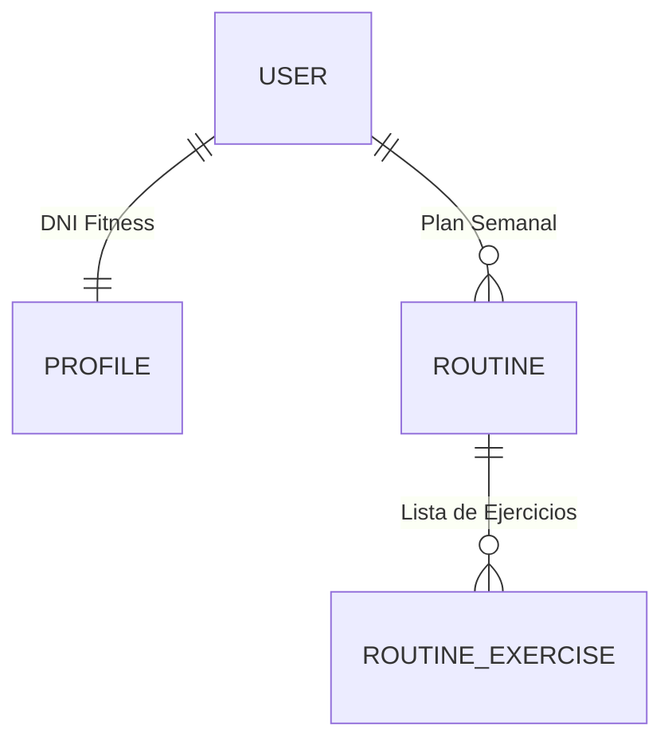

# 🏋️‍♂️ GymAI: Tu Entrenador Personal Inteligente

Bienvenido a **GymAI**, una solución tecnológica de vanguardia que transforma la manera en que planificamos el entrenamiento. No es solo una app de ejercicios; es un ecosistema donde la **Inteligencia Artificial** actúa como un entrenador real, consultando libros técnicos y bases de datos globales para crear el plan perfecto para ti.

---

## 🌟 ¿Qué hace GymAI? (El Flujo de Magia)

Para entender el proyecto, imagina este camino:

1.  **Conocerte**: El usuario rellena su perfil (peso, altura, objetivo). Esto es el **DNI Fitness**.
2.  **Conversar**: Chateas con GymAI. Puedes decirle: *"Quiero mejorar mi pecho, pero solo tengo mancuernas y entreno 3 días"*.
3.  **Investigar**: La IA no inventa. Usa herramientas (**Tools**) para:
    *   Leer la **Enciclopedia de Musculación** (vía RAG) para saber qué pesos y series te tocan.
    *   Consultar **AscendAPI** para traerte el vídeo en HD y las instrucciones exactas del ejercicio.
4.  **Materializar**: Una vez estás de acuerdo, la IA "escribe" en tu base de datos y crea tu calendario de entrenamiento automáticamente.

---

## 🏗️ Arquitectura: ¿Cómo está construido?

### 🎨 El Frontend (La Cara Visible)
*Construido con Vue 3 + Tailwind CSS*
*   **Chat Interactivo**: Conversación en tiempo real.
*   **Visor de Rutinas**: Interfaz premium con vídeos incrustados y series/reps calculadas.

### ⚙️ El Backend (El Cerebro)
*Construido con Django + LangChain*
*   **Agente de IA**: Un orquestador que usa **Ollama** localmente.
*   **Motor de Conocimiento**: Sistema vectorial para leer PDFs técnicos.

---

## 📊 El Corazón de los Datos: Esquema Relacional



---

## 🛠️ Guía de Instalación Paso a Paso

Sigue estas instrucciones para replicar el proyecto en tu equipo local:

### 1. Instalación de Ollama (El motor de la IA)
GymAI utiliza modelos de lenguaje locales para garantizar la privacidad y reducir costes.
1.  Descarga e instala **Ollama** desde [ollama.com](https://ollama.com/).
2.  Una vez instalado, abre una terminal y descarga el modelo necesario:
    ```bash
    ollama run qwen3:14b
    ```

### 2. Configuración del Backend (Django + IA)
Entra en la carpeta del backend y prepara el entorno de Python:

```bash
# 1. Entrar a la carpeta
cd backend

# 2. Crear entorno virtual (Aísla las librerías del proyecto)
python -m venv venv

# 3. Activar el entorno virtual
# En Windows:
venv\Scripts\activate
# En Linux/Mac:
source venv/bin/activate

# 4. Instalar todas las librerías necesarias
pip install -r requirements.txt

# 5. Preparar la base de datos
python manage.py migrate

# 6. Iniciar el servidor del cerebro
python manage.py runserver
```

### 3. Configuración del Frontend (La Interfaz)
Abre una **nueva terminal** y configura la parte visual:

```bash
# 1. Entrar a la carpeta
cd frontend

# 2. Instalar dependencias de Node.js
npm install

# 3. Iniciar la aplicación
npm run dev
```

### 4. Variables de Entorno (Las Llaves)
Para que el sistema pueda traerte los vídeos y ejercicios, necesitas una llave de acceso. 

1.  **Consigue tu API Key**: Haz clic en el siguiente enlace, regístrate (es gratuito) y copia tu `X-RapidAPI-Key`:
    *   👉 [**Obtener mi API Key en RapidAPI (AscendAPI)**](https://rapidapi.com/ascendapi/api/edb-with-videos-and-images-by-ascendapi/playground/apiendpoint_bafbc96b-3f58-4a76-aad0-6f8bc44d3afb)

2.  **Configura tu archivo**: Crea un archivo llamado `.env` en la raíz del proyecto y pega tu clave:
    ```env
    RAPIDAPI_KEY=pega_aqui_tu_llave_de_rapidapi
    RAPIDAPI_HOST=edb-with-videos-and-images-by-ascendapi.p.rapidapi.com
    ```

---

## 🧠 Reflexión Final: Retos y Aprendizajes

Este proyecto ha sido un desafío de ingeniería que va más allá de un simple chat. A continuación, detallo las conclusiones y problemas enfrentados durante el desarrollo:

### ⚙️ Limitaciones de Hardware y Software
La experiencia con GymAI depende directamente de la capacidad computacional. Al ejecutar **Ollama de forma local**, la velocidad de respuesta y la profundidad del razonamiento del agente varían drásticamente según la GPU disponible. Una mayor capacidad de hardware no solo reduce la latencia, sino que permite usar modelos con más parámetros que siguen mejor las instrucciones complejas.

### 🏋️ El Reto de la Calibración de Cargas
Uno de los problemas más complejos ha sido la recomendación de pesos. Aunque la IA consulta la **Enciclopedia de Musculación**, es difícil lograr una precisión absoluta en la relación entre el nivel del usuario y el tipo de ejercicio:
*   **Ejercicios Compuestos vs. Aislados**: No es lo mismo manejar 10kg en una sentadilla que en una extensión de tríceps. Mientras que en uno es un peso insignificante, en otro puede representar una intensidad máxima. 
*   **Personalización Dinámica**: Conseguir que la IA ajuste el peso de forma perfecta para un "principiante" en todos los ejercicios es un reto abierto, ya que la intensidad percibida es subjetiva y varía según la biomecánica de cada persona.

### 🎮 Control y Predictibilidad
Trabajar con agentes autónomos implica aceptar que no siempre se tiene un control del 100% sobre la salida. A pesar de los filtros antialucinación implementados en Python, los modelos de lenguaje a veces intentan "rellenar" información cuando las APIs externas no devuelven datos, lo que requiere un monitoreo y ajuste constante de los prompts del sistema.

### 🚀 Futuro del Proyecto
A pesar de estas limitaciones, GymAI sienta las bases de un sistema donde la IA no solo informa, sino que **actúa y automatiza**, integrándose en el flujo real de la vida del usuario para mejorar su salud de forma basada en evidencia.
