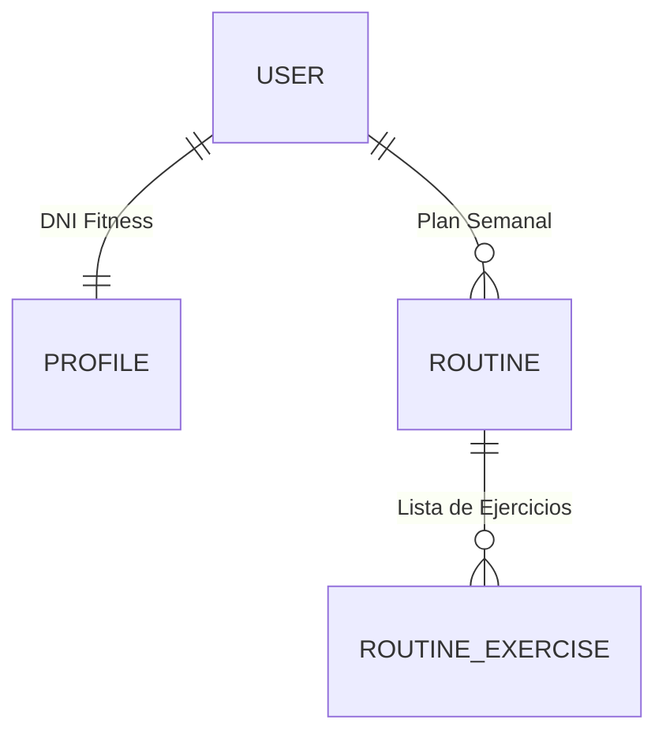

# 🏋️‍♂️ GymAI: Tu Entrenador Personal Inteligente

Bienvenido a **GymAI**, una solución tecnológica de vanguardia que transforma la manera en que planificamos el entrenamiento. No es solo una app de ejercicios; es un ecosistema donde la **Inteligencia Artificial** actúa como un entrenador real, consultando libros técnicos y bases de datos globales para crear el plan perfecto para ti.

---

## 🌟 ¿Qué hace GymAI? (El Flujo de Magia)

Para entender el proyecto, imagina este camino:

1.  **Conocerte**: El usuario rellena su perfil (peso, altura, objetivo). Esto es el **DNI Fitness**.
2.  **Conversar**: Chateas con GymAI. Puedes decirle: *"Quiero mejorar mi pecho, pero solo tengo mancuernas y entreno 3 días"*.
3.  **Investigar**: La IA no inventa. Usa herramientas (**Tools**) para:
    *   Leer la **Enciclopedia de Musculación** (vía RAG) para saber qué pesos y series te tocan.
    *   Consultar **AscendAPI** para traerte el vídeo en HD y las instrucciones exactas del ejercicio.
4.  **Materializar**: Una vez estás de acuerdo, la IA "escribe" en tu base de datos y crea tu calendario de entrenamiento automáticamente.

---

## 🏗️ Arquitectura: ¿Cómo está construido?

### 🎨 El Frontend (La Cara Visible)
*Construido con Vue 3 + Tailwind CSS*
*   **Chat Interactivo**: Conversación en tiempo real.
*   **Visor de Rutinas**: Interfaz premium con vídeos incrustados y series/reps calculadas.

### ⚙️ El Backend (El Cerebro)
*Construido con Django + LangChain*
*   **Agente de IA**: Un orquestador que usa **Ollama** localmente.
*   **Motor de Conocimiento**: Sistema vectorial para leer PDFs técnicos.

---

## 📊 El Corazón de los Datos: Esquema Relacional



---

## 🛠️ Guía de Instalación Paso a Paso

Sigue estas instrucciones para replicar el proyecto en tu equipo local:

### 1. Instalación de Ollama (El motor de la IA)
GymAI utiliza modelos de lenguaje locales para garantizar la privacidad y reducir costes.
1.  Descarga e instala **Ollama** desde [ollama.com](https://ollama.com/).
2.  Una vez instalado, abre una terminal y descarga el modelo necesario:
    ```bash
    ollama run qwen3:14b
    ```

### 2. Configuración del Backend (Django + IA)
Entra en la carpeta del backend y prepara el entorno de Python:

```bash
# 1. Entrar a la carpeta
cd backend

# 2. Crear entorno virtual (Aísla las librerías del proyecto)
python -m venv venv

# 3. Activar el entorno virtual
# En Windows:
venv\Scripts\activate
# En Linux/Mac:
source venv/bin/activate

# 4. Instalar todas las librerías necesarias
pip install -r requirements.txt

# 5. Preparar la base de datos
python manage.py migrate

# 6. Iniciar el servidor del cerebro
python manage.py runserver
```

### 3. Configuración del Frontend (La Interfaz)
Abre una **nueva terminal** y configura la parte visual:

```bash
# 1. Entrar a la carpeta
cd frontend

# 2. Instalar dependencias de Node.js
npm install

# 3. Iniciar la aplicación
npm run dev
```

### 4. Variables de Entorno (Las Llaves)
Para que las APIs de ejercicios funcionen, crea un archivo llamado `.env` en la raíz del proyecto y añade tus credenciales de RapidAPI:
```env
RAPIDAPI_KEY=tu_clave_de_rapidapi_aqui
RAPIDAPI_HOST=edb-with-videos-and-images-by-ascendapi.p.rapidapi.com
```

---

## 🧠 Reflexión Final
GymAI demuestra cómo la **IA Generativa** puede ser **determinista y útil**. Al usar filtros de seguridad (anti-alucinación) y consultas a libros reales, garantizamos que el entrenamiento propuesto sea seguro, científico y personalizado.
